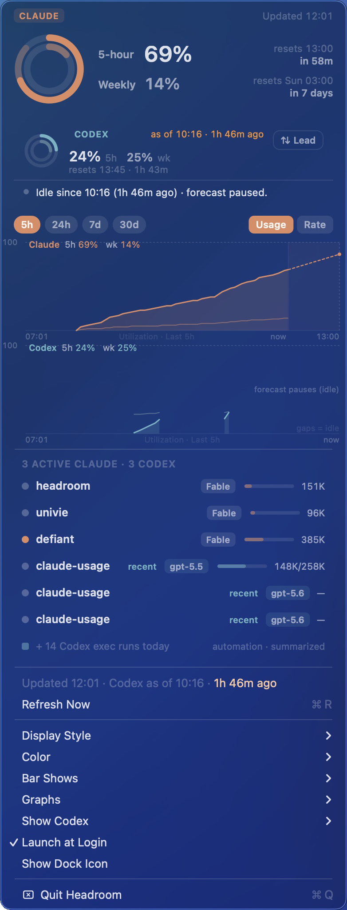
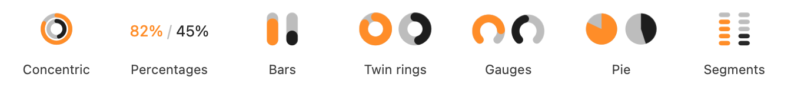

<p align="center">
  
</p>

<h1 align="center">Headroom</h1>

<p align="center">
  A tiny native macOS menu-bar app that shows how much headroom is left in your
  <b>Claude</b> and <b>OpenAI Codex</b> rate limits: the <b>5-hour</b> and
  <b>weekly</b> window, whichever of them your account reports.
</p>

<p align="center">
  <sub>Formerly <b>Claude Usage</b>. v0.8 and earlier releases carry the old name.</sub>
</p>

Claude numbers come from the authenticated usage API, read with the OAuth token
Claude Code already stores in your login Keychain, the same data that powers
Claude Code's `/usage` command. Codex numbers are reconstructed strictly
read-only from the rollout logs the Codex CLI writes under `~/.codex/sessions`.
No servers, no accounts, no config files, no telemetry. It talks to Anthropic
only, and never to OpenAI at all.

<p align="center">
  
</p>
<p align="center">
  <sub>The panel: one provider leads with the large rings, the other sits in the
  compact card, and below sit the history graphs and the live Claude and Codex
  sessions on this Mac.</sub>
</p>

> **Unofficial.** Not affiliated with, or endorsed by, Anthropic or OpenAI. The
> Claude side relies on a private endpoint that Claude Code uses internally:
> undocumented, and liable to change or break without notice. The Codex side
> reads undocumented local log formats and may break silently when the CLI
> changes them. It reads your local Claude Code OAuth token from the Keychain,
> sends requests only to `api.anthropic.com` and `console.anthropic.com`, and
> never reads `~/.codex/auth.json` or touches the network for Codex. Use at your
> own risk.

## The panel

Opening the menu shows one provider as the primary instrument, drawn large: the
outer ring is the 5-hour window, the inner one the weekly window, each with its
percentage and reset time in absolute and relative form ("resets 17:40 · in
3h 12m"). When the current pace would fill the 5-hour window before it resets, a
fainter arc extends the outer ring to the projected value and turns amber once
the projection reaches 100%.

Codex does not always report both windows. Since 12 July 2026 it has reported
some accounts as weekly-only, and Headroom takes each window from the
`window_minutes` the log carries rather than from its position, so it shows what
the account actually has. A provider with one window is drawn as a single ring,
with that window's value in the headline slot.

The other provider sits just below in a compact secondary card with small rings,
inline numbers, and a reset line. A **Lead** button swaps the two in place: the
provider you promote takes the large rings (and the menu-bar readout, when the
bar is set to show the primary), and the previous leader drops into the card.
The choice persists.

Below the graphs, the app lists live sessions on this Mac under a split header
("2 active Claude · 1 Codex"): a busy/idle dot, the project name, the model
family as a small chip (for example Opus, Fable, gpt-5.5), and the context fill
as a thin bar next to the token count where one is available. The context bar is
scaled to the model's advertised window and is therefore approximate by design.
Bulk `codex exec` and automation runs are not listed one by one; they are
summarized in a single muted row ("+ 14 Codex exec runs today"). Sessions are
read from local files each CLI maintains for its own purposes, so this section
may break silently when either tool changes its internal layout.

## Where the numbers come from

**Claude** is polled from the usage API using the OAuth token Claude Code stores
in your login Keychain. The token is read silently and cached in memory. It is
refreshed only as a last resort and never while any Claude Code process is
running: the refresh token is single-use, so spending it would log a live
Claude Code out. While one runs, the app adopts whatever fresh token Claude Code
writes. Requests go only to `api.anthropic.com` and `console.anthropic.com`.

**Codex** has no usage API and no auth we touch. Instead the app reconstructs a
snapshot strictly read-only from the point-in-time server values Codex appends
to its rollout logs the last time it ran. The consequence, which the panel
states honestly rather than hiding: a Codex reading is an estimate **as of** the
last observed rollout activity, and the panel prints that age explicitly, for
example `as of 10:16 · 1h 15m ago`. When a window's reset has passed with no
new Codex activity, that window honestly reads 0% ("reads 0% until Codex runs")
rather than showing a stale figure. While Codex is idle the forecast is paused
(the graph labels this `forecast pauses (idle)`), and gaps in the Codex history
line mean idle, not missing data (`gaps = idle`). The numbers are as precise as
the last log entry and no more; the app does not pretend otherwise.

## Display styles and color

Pick how the menu-bar readout looks with the **Style** popup in **Settings →
Menu Bar** (choose **Settings…** in the dropdown): **Concentric rings**
(default; outer = 5-hour, inner = weekly), a **Single ring (main limit)**
showing just that provider's main window, **Percentages**, or **Bars**. The ring styles
carry the forecast arc described above; percentages and bars stay static.
Earlier versions offered four more styles (twin rings, gauges, pie slices,
segments); these were retired in v0.6 since they either duplicated the concentric
information at twice the width or lost resolution at menu-bar size, and a saved
choice of a retired style now falls back to concentric rings.



The **Color** popup on the same tab controls how usage maps to color:

- **Brand** (default): each provider's accent, coral for Claude and teal for
  Codex, tuned for light and dark menu bars; red ≥ 90%
- **Monochrome**: adapts to the menu bar (light / dark)
- **Thresholds**: normal, orange ≥ 70%, red ≥ 90%
- **Heatmap**: green to red as usage climbs
- **System accent**: your macOS accent color

The panel follows the same choice: the header rings use the mode's value colors,
and the pills, session markers, and graph series take each provider's accent
under Brand (coral for Claude, teal for Codex), your macOS accent under System
accent, and neutral ink for the other modes, which reserve color for warnings
and data.

## Usage history and forecast

The panel draws stacked per-provider history graphs; hovering one shows exact
values and timestamps. Ranges (**5h**, **24h**, **7d**, **30d**) and the mode
switch (**Usage** and **Rate**) sit as pills directly above the graphs, and
clicking them keeps the menu open.

In **Usage** mode with the 5h or 24h range, the time axis extends past "now" to
the end of the current 5-hour window and the last hour's fill rate is projected
forward as a dotted line, drawn to the same time scale as the history (and in
the same color as the history line it extends) so its slope can be compared
directly. When the pace would reach 100% before the reset, a red dot marks the
crossing; the arc on the menu-bar rings shows the same projection. The 7d and 30d ranges show history
only, since five hours of look-ahead would collapse into a few pixels. **Rate**
mode instead plots how fast each window was filling over time. For Codex, the
projection is drawn only while the log is live; when Codex is idle the graph
says so instead of implying a projection.

The projection is a deliberately simple linear extrapolation of the last hour,
measured only within the current 5-hour window, and is best read as a lower
bound rather than a prediction. Samples are kept locally in small append-only
files (one per provider) and trimmed after about a month, so nothing leaves your
Mac.

## Settings

All options live in a tabbed Settings window: choose **Settings…** in the
dropdown (or press ⌘, while it is open). **About Headroom** opens the same
window on its About tab, which shows the version and build number.

- **General**: **Start Headroom at login** and **Show Dock icon** (the app is
  menu-bar only by default), plus **Bar shows** (default **Primary**): what the
  menu-bar item draws. **Primary** shows the leading provider; **Both** draws
  the two side by side; **Claude** or **Codex** shows that provider alone.
- **Menu Bar**: the **Style** and **Color** popups described above.
- **Codex**: **Show Codex** (default **Auto**: the Codex surfaces appear while
  `~/.codex` exists; **On** and **Off** force it) and **Graphs** (default
  **Both**): which provider history graphs are stacked in the panel.

Every change applies immediately. The Codex tab and the Bar shows option appear
only once Codex is present; with Codex hidden the app is the single-provider
Claude Usage panel it always was.

Headroom also checks GitHub for a newer release about once a day. When one is
available it shows on the About tab (and as a row in the dropdown); **Install and
Relaunch** downloads it, verifies the signature and notarization, swaps it in,
and restarts the app. Uncheck **Check for updates automatically** on the About
tab to turn the daily check off. Source builds, and copies running outside an
Applications folder, are offered a **View Release…** link to the download page
instead of an in-place install.

## Requirements

- Apple Silicon Mac, macOS 13 (Ventura) or later.
- [Claude Code](https://docs.anthropic.com/en/docs/claude-code) installed and
  **signed in** for the Claude side. That is what creates the Keychain item the
  app reads.
- Codex is optional. With **Show Codex** on **Auto** (the default) it appears
  whenever `~/.codex` exists, created the first time you run the Codex CLI. Until
  a session has logged usage it reads "No usage data yet".

## Install

### Download (recommended)

Grab the latest **notarized** build from the
[Releases page](https://github.com/smeingast/headroom/releases/latest), unzip,
and drag **Headroom.app** to `/Applications`. It is signed with a Developer ID
and notarized by Apple, so it opens with no Gatekeeper warning.

### Build from source

Needs the Swift toolchain (Xcode, or Command Line Tools via `xcode-select --install`):

```sh
./build.sh              # build/Headroom.app  (ad-hoc signed)
./build.sh --install    # also copies to /Applications and clears quarantine
```

The result is a self-contained `.app` that uses only system frameworks. It is
deliberately light: one status item and a roughly 5-minute poll (plus an
on-demand refresh when you open the menu) with rate-limit backoff. The Codex
side is a separate read-only pass over local files on the same cadence.

<details>
<summary><b>Maintainer: cutting a notarized release</b></summary>

With a **Developer ID Application** certificate installed, `build.sh` signs with a
hardened runtime automatically. To produce and zip the notarized, stapled `.app`:

```sh
./tools/notarize_setup.sh   # one-time: store Apple notary credentials in the keychain
./build.sh --notarize       # sign, submit to Apple, staple, verify
ditto -c -k --keepParent "build/Headroom.app" "build/Headroom-vX.Y.zip"
```

`build.sh` does not bundle the versioned zip itself, hence the `ditto` step.
`notarize_setup.sh` needs an **app-specific password** (account.apple.com,
Sign-In and Security). Your Apple ID and Team ID live only in the keychain and
never touch the repo.

That same zip is the in-app update artifact, so three invariants matter for the
updater to work:

- The release asset must be named exactly `Headroom-<tag>.zip` with `Headroom.app`
  at the top level of the archive.
- The tag must be `vX.Y[.Z]` (dotted integers), for example `v0.11` or `v0.11.2`.
- Never recreate or backdate a release. The updater trusts the ordering of
  `/releases/latest`; a pointer that moves backward makes the version compare fail
  closed, and users simply see "up to date". The in-app installer still verifies the
  Developer ID signature, notarization, and that the new version matches the tag
  before it swaps anything in, so a bad asset is refused rather than installed.
</details>

## First run

- **Keychain prompt: normally none.** The app reads the shared credentials the
  same way Claude Code itself does, which macOS allows silently. If macOS ever
  does ask (unusual setups), click **Always Allow** once.
- **Can't see it?** A menu-bar manager (Bartender, Ice, and similar) may be hiding
  it. Reveal the hidden section and Command-drag the item where you want it.

## How it works

| Piece | Detail |
|-------|--------|
| Claude usage | `GET /api/oauth/usage`: `five_hour.utilization`, `seven_day.utilization` (plus model-specific weekly caps when in use) |
| Claude auth | OAuth token shared with Claude Code (Keychain service `Claude Code-credentials`), read silently and cached in memory. Refreshed only as a last resort and **never while any Claude Code process is running**: the refresh token is single-use, so spending it would log a live Claude Code out. While one runs, the app adopts whatever fresh token Claude Code writes |
| Codex usage | Reconstructed **read-only** from `~/.codex/sessions/**/rollout-*.jsonl`: the newest logged `token_count` event's `rate_limits` (`used_percent`, `window_minutes`, `resets_at`). No API, no network, and never `auth.json`. The value is stamped "as of" the event time; a window whose reset has passed with no new activity reads 0% (inferred idle) |
| Claude sessions | Live Claude Code sessions on this Mac (project, model, status, context tokens), read from `~/.claude/sessions/*.json` and each session's transcript tail. Local only; undocumented internal state, so liable to change between CLI versions |
| Codex sessions | Interactive Codex sessions (`source == "cli"`) from the same rollout logs: project, model, context tokens, active or recent. `codex exec` runs are counted, not listed. Local only, undocumented log format, liable to change |
| Usage history | Past 5-hour and weekly utilization, sampled on each successful poll into append-only files under Application Support (one per provider) and trimmed to about 32 days. Local only |
| Forecast | The last hour's fill rate, measured within the current 5-hour window and projected linearly to its reset. Drives the dotted graph projection and the arc on the ring glyphs; computed locally per provider, and paused for Codex whenever its log is idle or its account reports no 5-hour window |
| Display | `NSStatusItem` rendered as text or a drawn glyph: 4 styles × 5 color modes, one or both providers per **Bar Shows** |
| Footprint | Menu-bar only (`LSUIElement`); optional Dock icon; launch-at-login via `SMAppService` |

## Project layout

```
Sources/
  main.swift                 App entry + single-instance guard
  AppDelegate.swift          Status item, menus, polling, panel assembly (both providers)
  Providers.swift            Provider-generic usage/session models + result wrappers
  ProviderState.swift        Pure per-provider UI state: copy, freshness, severity
  UsageClient.swift          Claude usage fetch + token refresh
  Keychain.swift             Read/write the shared Claude Code credentials
  SessionsClient.swift       Local Claude Code session registry + transcript readers
  CodexUsageClient.swift     Read-only Codex usage snapshot + history backfill from rollout logs
  CodexSessionsClient.swift  Read-only Codex interactive sessions + exec-run summary
  JSONLBackscan.swift        EOF-first bounded line scanner shared by both providers' logs
  Forecast.swift             Fill rate + projection to the 5-hour reset
  HistoryStore.swift         Append-only local sample store (one file per provider)
  StatusRenderer.swift       Menu-bar display styles + color modes (text / drawn glyphs)
  SettingsWindow.swift       Tabbed Settings window (General / Menu Bar / Codex / About)
  HistoryGraphView.swift     History graph with forecast overlay, idle legends, and hover
  PanelViews.swift           Custom menu rows: header rings, sessions, range and mode pills
  PanelTwoProvider.swift     Two-provider panel chrome: rings, tag row, secondary strip, status copy, Lead
Resources/
  Info.plist                 Bundle manifest (LSUIElement = menu-bar only)
  AppIcon.icns               App icon
assets/                      README images (icon, two-provider dropdown, styles strip)
tools/
  icongen/main.swift         Renders the icon
  make_icon.sh               Builds AppIcon.icns
  codex_dump.swift           One-shot harness: live Codex snapshot + last backfill samples
  notarize_setup.sh          One-time: store Apple notary credentials (see Install)
Tests/                       swift-test unit gate, including render-goldens (pixel parity)
Package.swift                swift test manifest (Sources minus main.swift)
build.sh                     Compile, bundle, sign, optionally notarize and install
CLAUDE.md                    Build gates and conventions for contributors
```

## License

[MIT](LICENSE). Free to use, modify, and distribute. Provided **as is**, with no
warranty and no liability; use at your own risk.
